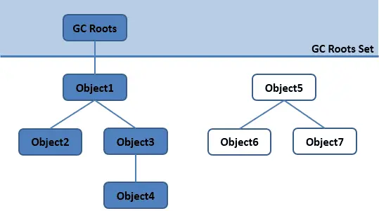
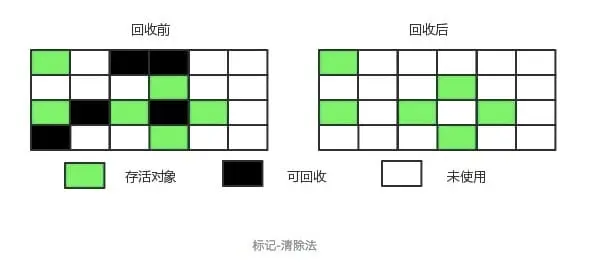
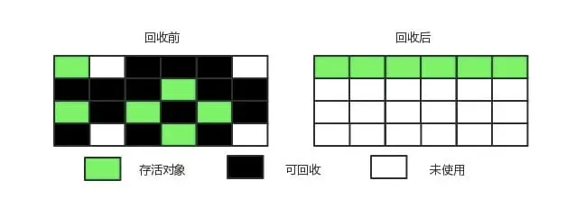

## java中的引用类型

**强引用**: 发生gc的时候不会被回收
```java
Object obj = new Object();
```

**软引用**: 只有在内存不足时才会被回收
```java
Object obj = new Object();
SoftReference<Object> sf = new SoftReference<Object>(obj)
obj = null;
```

**弱引用**: 被弱引用关联的对象一定会被回收，只能存活到下一次垃圾回收发生之前
```java
Object obj = new Object();
WeakReference <Object> wf = new WeakReference<Object>(obj);
obj = null;
```

**虚引用**: 一个对象是否有虚引用的存在，完全不会对其生存时间构成影响，也无法通过虚引用取得一个对象
```java
Object obj = new Object();
PhantomReference <Object> pf = new PhantomReference <Object>(obj);
obj = null;
```
为对象设置一个虚引用的唯一目的就是能在这个对象被回收时收到一个系统通知


## 垃圾回收算法

### 如何判断对象是否可以回收
#### 可达性算法分析
通过 GC Roots 作为起始点进行搜索，能够到达到的对象都是存活的，不可达的对象可被回收。


java的 GC Roots 包含以下对象：
· 虚拟机栈中引用的对象
· 本地方法栈中引用的对象
· 方法区中类静态属性引用的对象
· 方法区中的常量引用的对象
### 分代收集

根据对象的存活周期将内存划分为几块，不同块采用不同的收集算法
· 新生代 使用 复制算法
· 老年代 使用 标记 - 清除 或者 标记 - 整理 算法
### 复制算法

将新生代划分为一块较大的 Eden 空间和两块较小的 Survivor 空间，每次使用Eden空间和其中一块 Survivor。在回收时，将 Eden 和 Survivor 中还存活着的对象一次性复制到另一块Survivor 空间上，最后清理Eden和使用过的那一块 Survivor

HotSpot 虚拟机的 Eden 和 Survivor 的大小比例默认为 8:1,保证了内存的利用率达到90%。如果每次回收有多于 10% 的对象存活，那么一块 Survivor 空间就不够用了，此时需要依赖于老年代进行分配担保，也就是借用老年代的空间存储放不下的对象。

### 标记清除 标记整理



不足:
· 标记和清除过程效率都不高；
· 会产生大量不连续的内存碎片，导致无法给大对象分配内存。



让所有存活的对象都向一端移动，然后直接清理掉端边界以外的内存。

